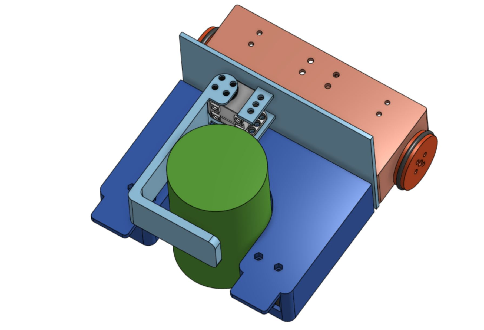

# 
BeerRobot
 
__Last update of README__ : 11/01/2023

## Introduction
Elèves en option ESE (Electronique et Systèmes Embarqués) au sein de l'ENSEA (Ecole Nationale Supérieures de l'Electronique et de ses Applications), réalisant un robot comme projet central de leur option.  

## Objectifs du projet
Le but du projet est de créer un robot permettant d'attraper des canettes, de relever la couleur de cette dernière, se déplacer avec la canette attrapée et la déposer dans la zone adaptée selon sa couleur. Par ailleurs le robot devra se repérer sur une table afin de ne pas tomber.   

## Membres du groupe et rôles
Le groupe de projet est constitué de 4 membres, chacun ayant divers responsabilités.  
- __Chelsea COMLAN__ : responsable Hardware
- __Loïcia KOEHL__ : responsable intégration
- __Quentin SIMON__ : responsable Software
- __Alix HAVRET__ : responsable livrables

__Encadrants du projet__ : Mr Fiack , Mr Tauvel
__ Intervenants extérieur__ : Mme Quittel, Mr Jauffrey, Mr Le Bidan

### Contenus des dossiers
  #### Additional documents
Contient l'ensemble des images necessaire à la rédaction de ce README, le rapport de mi-projet rédigé en novembre ainsi que le diaporama de notre présentation du robot en décembre.   

  #### Hardware
Contient le projet Kicad avec l'ensemble des fichiers electronique ainsi que le fichier de routage du PCB.  
Le PCB a été produit à l'extérieur de l'ENSEA.  

  #### Software 
Contient les codes "annexes", c'est à dire les codes des composants testé sur le STM32F746NG.  
Le projet CubeIDE a destination de la STM32G0 (notre microcontroleur de projet) se trouve sur la master. 

  #### 3D 
  Contient certains fichiers 3D pour la réalisation du robot

## Architecture générale du projet

Au debut du projet nous avons eu la liste de l'ensemble des composants auxquels nous avions accès pour la réalisation du robot et afin de remplir ses divers fonctionnalités.   
Le schéma architectural au début du projet nous a permit de définir l'ensemble des entrées necessaires dans notre microcontroleur et les divers flux de données qui allaient entrer en jeu.  

### Rôles et utilité des divers composants, capteurs 
#### Moteurs FIT501
Deux Moteurs à courant continu, alimenté en xx V, permettant de faire tourner 2 roues. Le moteur a également un encodeur.  

### Servomoteur XL320
Servomoteur qui permettra de faire bouger la pince necessaire pour saisir les canettes.

### Capteur couleur TCS3200
Capteur permettant de detecter la couleur de la canette à l'aide de filtres superposés à des LEDS.

### Capteur de bordure 
Capteur infra-rouge qui détecte si il y a un object en face de lui.

### Capteur TOF 
Time Of Flight, renvoie le temps qu'a prit la source lumineuse du capteur pour rebondir sur un object et revenir. Cela nous permet d'avoir notre distance par rapport à un objet. (en mm)

## 3D du robot 
Nous avons prit la décision de modifier le design initial du robot sur onshape.  
Ajout d'un roulement en plus à l'avant, modification de l'emplacement de la pince et la forme de celle ci. Une fois le PCB reçu, des modifications seront effectuées afin de permettre un bon placement de l'ensemble des fils.  
Par ailleurs nous avons aménagés divers emplacements pour les différents capteurs : couleurs, bordure et distance, ainsi que pour les fils.  
  
 
 
## Hardware 
### Schema electrique
A partir du schema architectural réalisé au début du projet, nous avons comment le schéma électrique du projet sur Kicad.  
Ce dernier a été séparé en plusieurs feuilles afin de pouvoir organiser les différentes partie : STM32, alimentation, capteurs, moteurs, servomoteur.
### PCB
__09/11/2022__ Reception du PCB
__Soudeurs__ : Loïcia et Chelsea
L'ensemble des soudures ont été réalisées à la main, lee 25/11/2022  l'ensemble des composants étaient soudés sur la carte.   
Nous avons soudés les connecteurs au fur et à mesure de la réalisation des tests.

## Software

Le code sera utilisé dans diverses tâches (utilisation de FreeRTOS). Chaque état décrit dans le diagramme à états correspondra à une tâche.  
Une tâche pourra faire appel à de la donnée, ou en consommer. Dans chaque tâche nous feront appel à divers bouts de code permettant de démarrer un capteur, un moteur, un servo, etc ...

### Premiers Tests
Pour effectuer nos tests sur les capteurs, nous avons implémentés un shell. Chacun des capteurs ont été validé sur la STM32F746NG, et ensuite leur code était intégré à la STM32G0.
La shell nous a permit de faire une première démonstration. Par la suite implémentation d'une tache avec les commandes necessaires.

### Moteurs : 
Problème de vitesse. Asservissement necessaire.
Asservissement : ...

### Capteurs 
#### Capteur bordure 
#### Capteur TOF 
#### Capteur couleurs

Objectif de la présentation finale : 
Présenter son robot avec un code intégré et prévoir une echainement d'action :  
- repérer la canette
- avancer vers elle 
- l'attraper
- vérifier qu'elle est attrapée
- 

